# ✌️SKN04-2nd-1Team

# 가입 고객 이탈 예측
<p align="center"></p>

<hr>

## 👍정훈대장👍
 
### 🤦‍♂️ 팀원

<p align="center">
	
	
	
	
</p>

<div align="center">

	
|   &nbsp;&nbsp; &nbsp; &nbsp; &nbsp;  &nbsp;  &nbsp;👼 박병헌  &nbsp;&nbsp; &nbsp;&nbsp; &nbsp;  &nbsp;  &nbsp;    |      &nbsp;&nbsp; &nbsp;&nbsp; &nbsp;  &nbsp;  &nbsp;👼 김현재  &nbsp;&nbsp; &nbsp;&nbsp; &nbsp;  &nbsp;  &nbsp;    |      &nbsp;&nbsp; &nbsp;&nbsp; &nbsp;  &nbsp;  &nbsp;👼 변가원  &nbsp;&nbsp; &nbsp;&nbsp; &nbsp;  &nbsp;  &nbsp;    |     &nbsp;&nbsp; &nbsp;&nbsp; &nbsp;  &nbsp;  &nbsp;👼 김정훈  &nbsp;&nbsp; &nbsp;&nbsp; &nbsp;  &nbsp;  &nbsp;   | 
|------------------------------------------|--------------------------------------|------------------------------------------|-----------------------------------|
</div>

<hr>

### 👨‍🏫 프로젝트 개요
  기업에게 고객 이탈은 중요한 문제입니다. <br>
  다른 경쟁사로 고객이 이동하는 행위는 기업 수익성과 관련하여 큰 문제이기 때문에 고객 이탈을 사전에 예방해야합니다. 그렇기에 저희 팀은 주어진 고객 데이터를 기반하여 고객이탈 예측 모델을 제작하여 사전에 이탈 가능성이 높은 고객을 찾아 예방하고자 합니다.

<hr>

### 👩‍🏫 프로젝트 목표
고객 이탈 예측 모델을 통해 이탈할 가능성이 높은 고객을 잡아낼 수 있도록 합니다.


<hr>

### 🔨 기술 스택
<div>
 


</div>

<hr>

### Prerequisites

```cmd
pip install pandas 
pip install numpy 
pip install scikit-learn
pip install torch
pip install pytorch-lightning
pip install nni
```

<hr>

### Usage

```cmd
python train.py
```

<hr> 

### Data

고객 데이터 중 <b>Churn</b>(고객 이탈 여부), <b>TotalRecurringCharge</b>(고객의 월 정기 요금),  <b>MonthsInService</b>(고객이 서비스를 사용한 기간), 
<b>CurrentEquipmentDays</b>(현재 기기를 사용한 일 수), <b>CreditRating</b>(고객의 신용 등급), <b>RetentionCalls</b>(고객 유지를 위한 전화 횟수), 
<b>RespondsToMailOffers</b>(고객이 우편 제안에 응답했는지 여부), <b>BuysViaMailOrder</b>(우편 주문을 통해 구매하는지 여부), <b>HandsetWebCapable</b>(웹 접속이 가능한 핸드셋을 사용 중인지 여부) 데이터를 사용하였습니다.

 <h3> 1. 고객 충성도 레이블 (Customer Loyalty)</h3>
 'MonthsInService'와 'RetentionCalls'을 기반으로 고객이 얼마나 오랜 기간 동안 서비스에 머물렀는지, 그리고 고객 유지 노력의 결과를 반영

 <h3>2. 서비스 사용 기간 레이블 (Equipment Usage Duration)</h3>
 'CurrentEquipmentDays'를 사용해 서비스를 얼마나 사용하고 있는지 반영
 <h3>3. 요금 부담 레이블 (Charge Burden)</h3>
 'TotalRecurringCharge'를 기준으로 요금 부담이 높은지 낮은지를 분류
 <h3>4. 신용 등급 레이블 (Credit Rating Category)</h3>
 'CreditRating'을 기준으로 신용 등급을 두 그룹으로 나눔
 <h3>5. 구매 및 메일 응답 행동 (Purchase and Mail Response Behavior)</h3>
 'BuysViaMailOrder'와 'RespondsToMailOffers'를 결합하여 고객의 마케팅 참여도 파악
 <h3>6. 핸드셋 웹 사용 가능 여부 (Handset Web Capability)</h3>
 'HandsetWebCapable'을 사용하여 핸드셋이 웹 사용 가능한지 여부를 분류
<br><br><br>
위와 같은 전처리를 통해 유의미한 결과를 도출하고자 하였습니다.


<hr>

# EDA

## 데이터 분석 및 ML

### base model
ML 모델이 Churn을 예측 하기 위해 유의미한 컬럼을 찾아야한다.
seaborn 패키지의 kdeplot 과 countplot을 사용하여 Churn에 따른 컬럼의 분포를 확인하였다.

찾아낸 유의미한 컬럼은 다음과 같다.

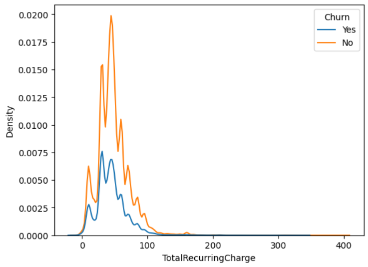


아래 5개의 컴럼에 대해서는 약간의 분포차이를 보인다.

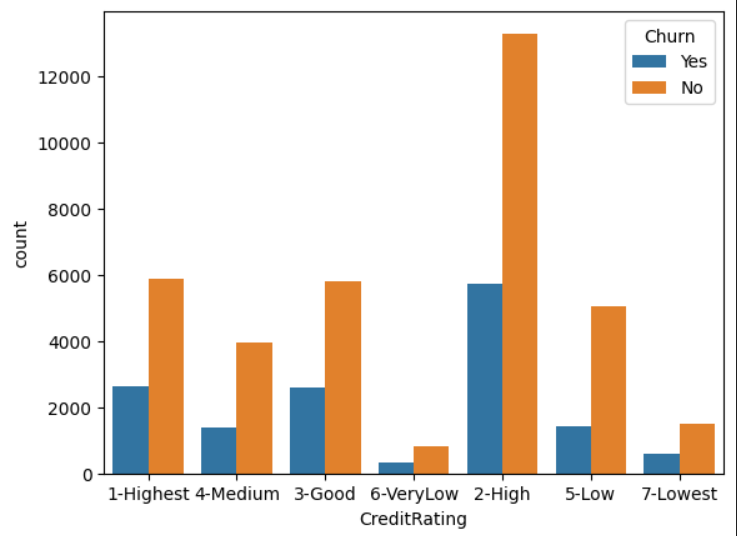

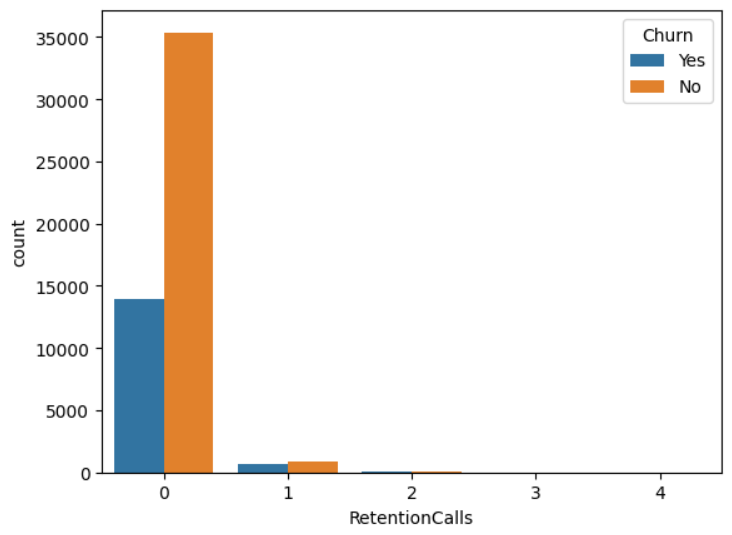


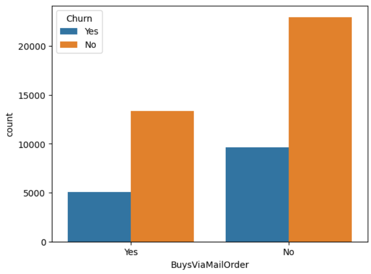

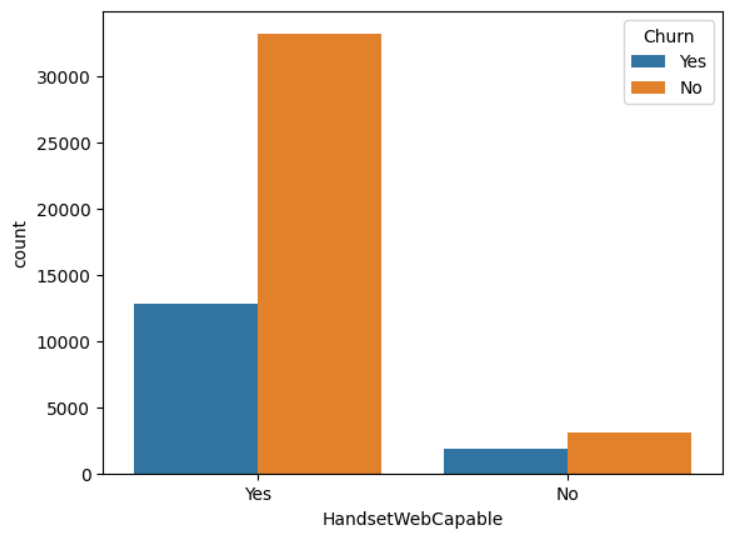

lightgbm 모델로 위에서 찾은 5개의 컬럼
모델결과

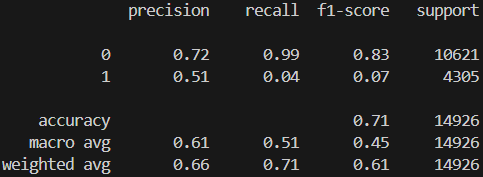


Churn에 대한 예측중 1에대한 예측(이탈한 사람) Recall이 0.04로 매우 낮은 모습을 보인다.
이것은 실제 이탈한 사람에 대하여 모델이 이탈하였다고 예측한 비율이 4%로, 이탈한 사람에 대한 예측을 못하고 있는 것을 알 수 있다.


### New feature model


유효한 feature가 부족하다고 판단하여, 극복하기 위해 분석을 통해 찾은 컬럼을 조합하여 새로운 Feature를 만드는 전략을 세웠다.

```Python

# 1. 고객 충성도 레이블 (Customer Loyalty)
# 'MonthsInService'와 'RetentionCalls'을 기반으로 고객이 얼마나 오랜 기간 동안 서비스에 머물렀는지, 그리고 고객 유지 노력의 결과를 반영
data['CustomerLoyalty'] = np.where(
    (data['MonthsInService'] > data['MonthsInService'].mean()) &
    (data['RetentionCalls'] > 0), 
    'High Loyalty', 'Low Loyalty'
)

# 2. 서비스 사용 기간 레이블 (Equipment Usage Duration)
# 'CurrentEquipmentDays'를 사용해 서비스를 얼마나 사용하고 있는지 반영
data['EquipmentUsageDuration'] = np.where(
    data['CurrentEquipmentDays'] > data['CurrentEquipmentDays'].mean(), 
    'Long-Term Equipment User', 'Short-Term Equipment User'
)

# 3. 요금 부담 레이블 (Charge Burden)
# 'TotalRecurringCharge'를 기준으로 요금 부담이 높은지 낮은지를 분류
data['ChargeBurden'] = np.where(
    data['TotalRecurringCharge'] > data['TotalRecurringCharge'].mean(), 
    'High Charge', 'Low Charge'
)

# 4. 신용 등급 레이블 (Credit Rating Category)
# 'CreditRating'을 기준으로 신용 등급을 두 그룹으로 나눔
data['CreditCategory'] = np.where(
    data['CreditRating'] > data['CreditRating'].median(), 
    'High Credit', 'Low Credit'
)

# 5. 구매 및 메일 응답 행동 (Purchase and Mail Response Behavior)
# 'BuysViaMailOrder'와 'RespondsToMailOffers'를 결합하여 고객의 마케팅 참여도 파악
data['MarketingEngagement'] = np.where(
    (data['BuysViaMailOrder'] == 'Yes') & (data['RespondsToMailOffers'] == 'Yes'), 
    'Fully Engaged',
    np.where(
        (data['BuysViaMailOrder'] == 'Yes') | (data['RespondsToMailOffers'] == 'Yes'), 
        'Partially Engaged', 'Not Engaged'
    )
)

# 6. 핸드셋 웹 사용 가능 여부 (Handset Web Capability)
# 'HandsetWebCapable'을 사용하여 핸드셋이 웹 사용 가능한지 여부를 분류
data['HandsetWebCapability'] = np.where(
    data['HandsetWebCapable'] == 'Yes', 
    'WebCapable', 'NonWebCapable'
)

```
위와 같이 6개의 feature를 생성했다.

생성된 feature도 아래와 같이 분석을 진행 했다.

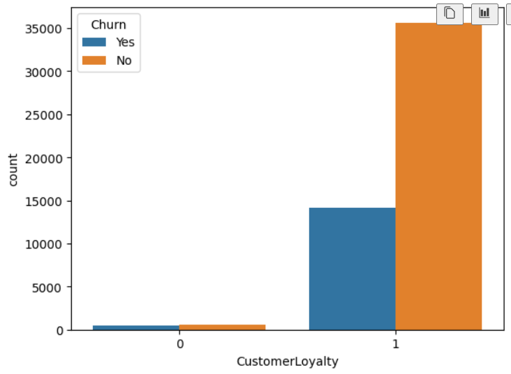

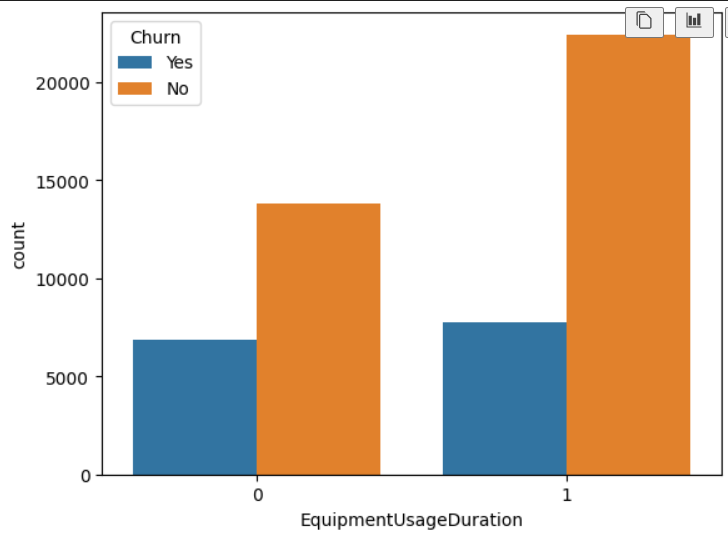

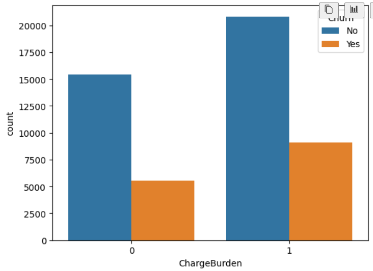

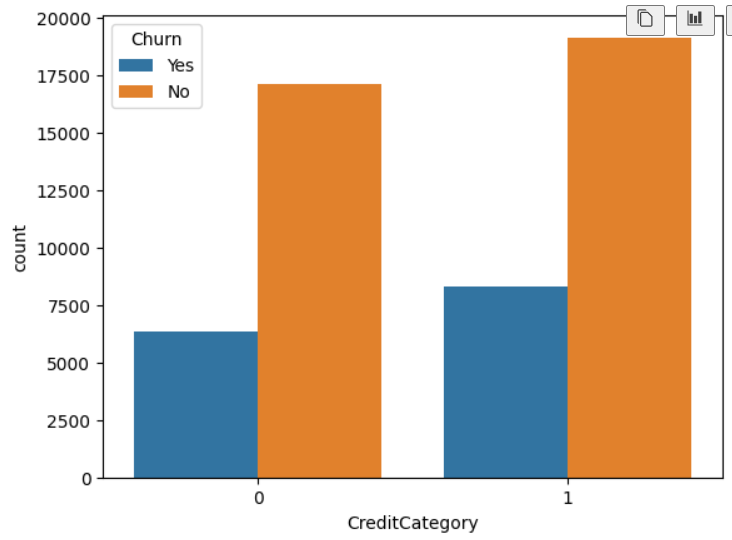

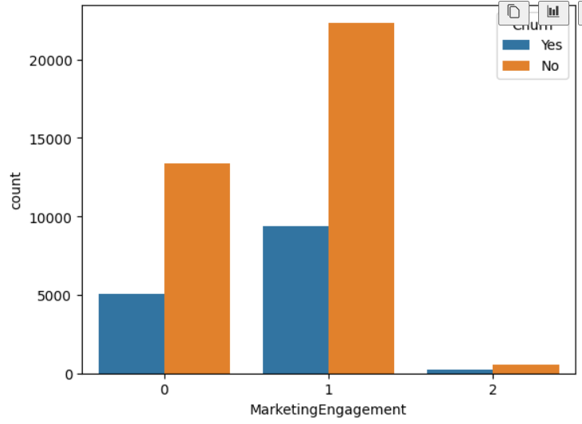

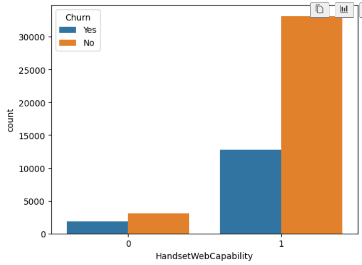

위와 동일하게 lightgbm 모델을 학습하여 예측하였고, 결과는 아래와 같다.

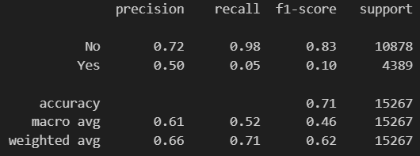

### New feature model_2

위에서 선정한 feature들 중 확연한 분포 차이를 보이는 feature를 재선정하여 4개의 컬럼으로 줄였다.
4개의 feature는 'TotlaRecurringCharge' 'MonthsInService' 'TotalRecurringCharge' 'CustomerLoyalty' 로 하였다.

다시한번 분포를 보면 다음과 같다.


동일하게 lightgbm 모델을 학습하여 다음과 같은 결과를 얻었다.

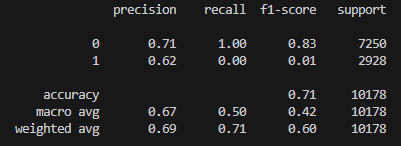

결과는 변하지 않았다. 


## DL

전체 데이터를 넣어 모델을 학습했을 때 결과는 아래와 같았습니다.<br><br>
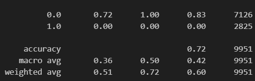
머신러닝을 돌렸을 때와 동일하게 확연한 분포 차이를 보이는 feature를 재선정하여 학습했을 때 결과는 아래와 같았습니다.<br><br>
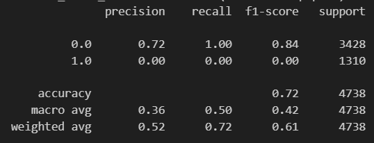
정확도가 0.72로 이전의 학습과 결과가 동일하다는 것을 알 수 있었습니다. <br><br>
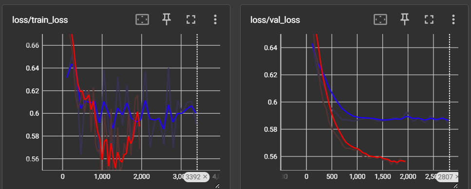<br>
<파랑 - 전처리 전 / 빨강 - 전처리 후> <br>
데이터를 전처리한 결과 정확도는 유의미한 차이가 없었지만 사진과 같이 loss에서 유의미한 차이를 볼 수 있었습니다.

데이터의 0(비이탈자)이 1(이탈자)에 비해 확연히 수가 많아 데이터가 불균형하여 실제 고객 이탈자를 이탈자로 구분을 못하고 있다는 것을 알 수 있었습니다. 


<hr>

## 수행 결과

정확도는 0.71로 나오는데, 이것은 사실 Churn 컬럼의 Yes, No 비율과 같다.

Yes는 35507개, No는 14245개 이고, 35507/(14245+35507) = 0.71 이다.
모델에서 Yes 와 No를 분리할수 있는 데이터를 학습하지 못했고, 이는 데이터가 Churn를 예측 할 수 있도록 데이터가 분되어있지 않다는 것을 의미한다. 

또한, 데이터의 크기가 Yes로 치우쳐져 거의 모든 예측을 Yes로 하게되는 데이터 불균형 문제도 가지고 있다.

두가지 문제로 정리하면,

1. Churn별 데이터의 분포가 분리되지 않는다.

2. 데이터 양이 Churn == 'Yes' 로 치우쳐있다.

1.에서 데이터가 얼마나 엉켜있는지 확인 하기 위해 T-SNE 방법을 이용하여 시각화 하였다.
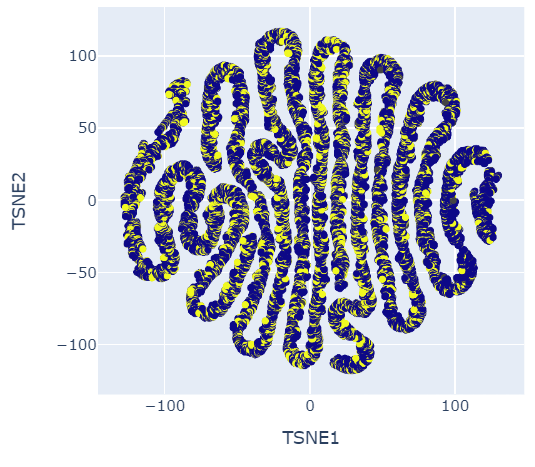
노란색: Yes, 파란색: No

분리가 안되는 데이터를 확인 할 수 있다.

2.의 문제를 해결하기 위해서는 Over Sampling 방법이 있다. 대표적으로 파이썬에서 smote(Synthetic Minority Over-sampling Technique) 방법이 있다. smote는 최근접 방법을 이용해서 새로운 데이터를 생성해준다. smote을 사용할때 유의 할 점은 precision과 recall 이다. recall를 증가시킬 수 있지만 precision이 떨어지기 때문에 잘 생각해서 사용해야된다.

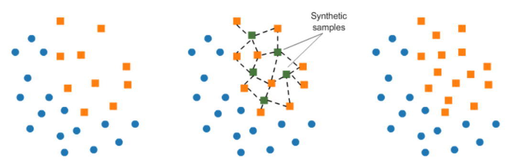
이미지 출처:https://www.kaggle.com/code/rafjaa/resampling-strategies-for-imbalanced-datasets


두 가지의 데이터 문제로 인하여 ML, DL 모두 정확도 약 0.71에서 개선되지 않았고, Yes에 대한 Recall이 매우 낮은 상황을 빠져나가지 못했다. 

<hr>

## 한 줄 회고
<br>

<h3>👼박병헌</h3>
<hr> 
<br><br>
<h3>👼김현재</h3>
<hr> 
ML이고 DL이고 데이터 전처리가 안되면 아무것도 못하는구나 난 꼭 이 일에 전문가가 되겠다는 마음을 가졌다.<br><br>
<h3>👼변가원</h3>
<hr> 
 수업시간 때 배운 내용들을 직접 적용해보면서 실제로 ML, DL에 대해 이해할 수 있는 경험을 할 수 있었습니다.<br><br>
<h3>👼김정훈</h3>
<hr> 
데이터 불균형 문제는 쉽지 않았습니다. 내가 원하는 결과를 내기 위해서 모델을 바꾸고 레이어를 늘려보고 다양한 방법을 시도해 보았지만 좋은 결과를 내는 것은 힘들었습니다. 이것이 인생이구나를 느꼈습니다.<br><br>